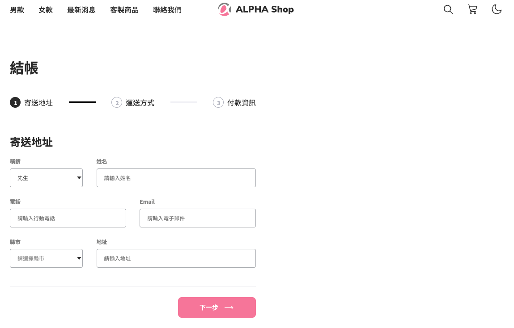

# AlphaShop - React

##  專案介紹

這是一份基於 React 框架製作的網站「結帳畫面」。
使用node版本為 v16.16.0（使用v14.16.0似乎無法啟動專案，原因尚未查明）

##  開啟專案

1.  確認已經安裝 node.js 與 npm
2.  clone 專案
3.  終端機進入資料夾並輸入：`$ npm install `
4.  安裝完畢後，繼續輸入：`$ npm start`
5.  專案將會在 http://localhost:3001/ 運行
5.  若要暫停使用，可在終端機執行：`ctrl + c`
